## Toonify Images for Painting

A C++ program that turns an image into a toon that can be painted
using a color palette.

The algorithm is based on the paper [*Toonify: Cartoon Photo Effect Application*](https://stacks.stanford.edu/file/druid:yt916dh6570/Dade_Toonify.pdf).

### Install, Compile, and Run

After installation of `opencv` via

	brew install opencv
	
compile the C++ program `toonify.cpp` with

	make
	
Usage

	./toonify [path_to_file] [num_colors] [blur_level] [scale_factor]
	
Number of colors and blur level control the resolution of the toonified image.
For example, the number of colors should be 16 or 20 for a nice effect. The blur level should be 11, 17, or higher for larger images (it must be an odd integer number). A scale factor of *x* means that the image will be *x* times larger than the original
(use with caution!).
	
### Example 1

The original image (New Zeland).

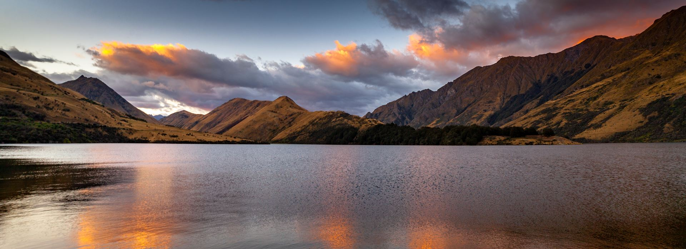

Its toonified version.

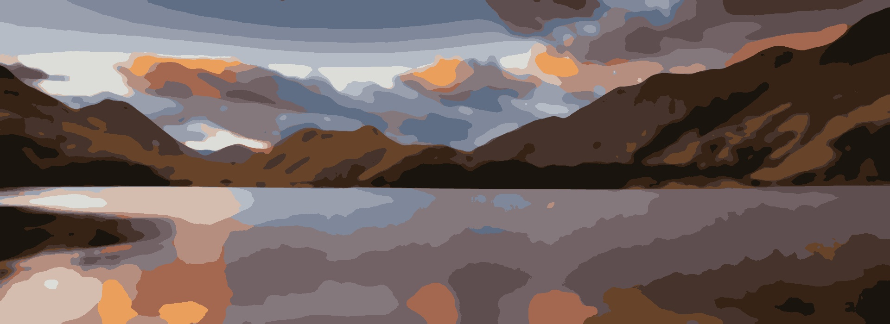

The corresponding canvas annotated with colors' numbers
from the palette.

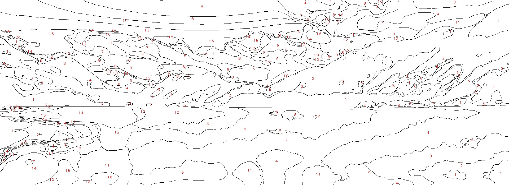	

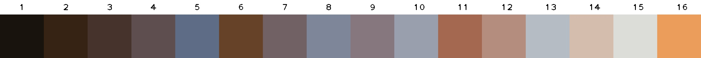	

These three files (toonified image, canvas, and palette) are obtained with

	./toonify images/new_zeland.jpg 16 21 1.0

### Example 2

The original image (Madonna di Campiglio, Trentino).

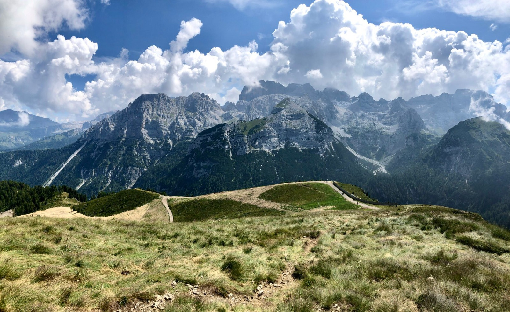

Its toonified version.

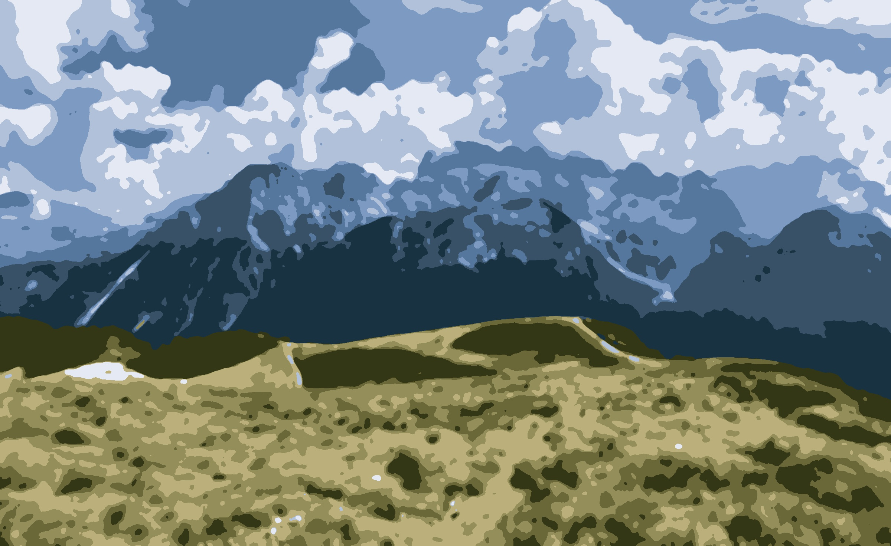

The corresponding canvas annotated with colors' numbers
from the palette.

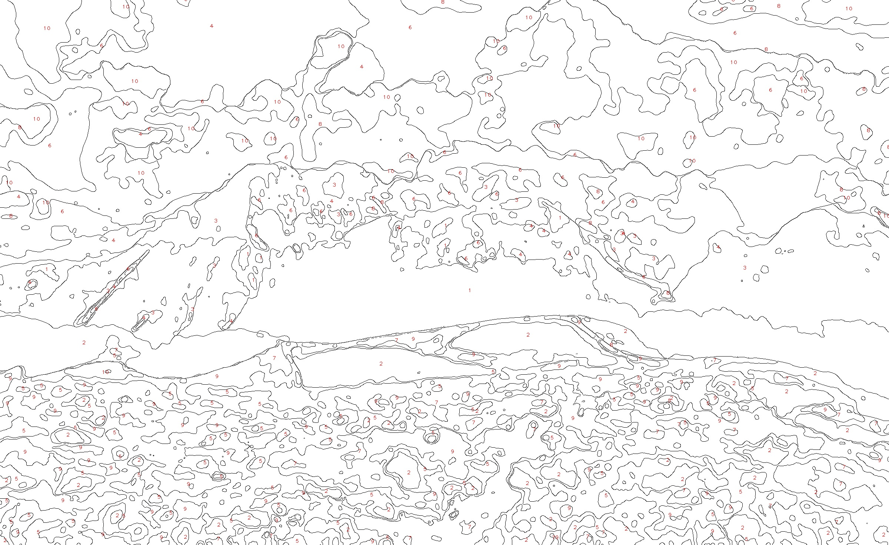	

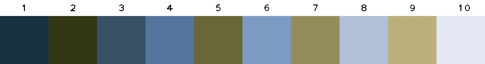	

These three files (toonified image, canvas, and palette) are obtained with

	./toonify images/fiamma.jpg 10 17 1.5

### Example 3

The original image (Elena).

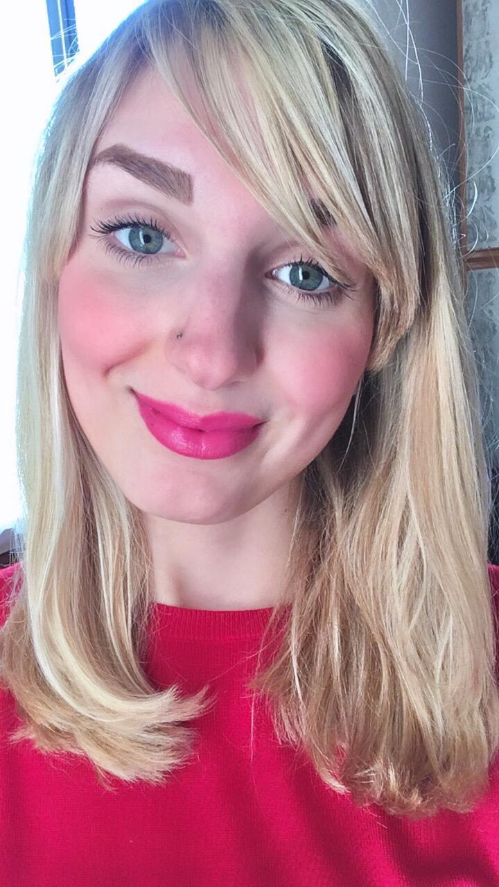

Its toonified version.

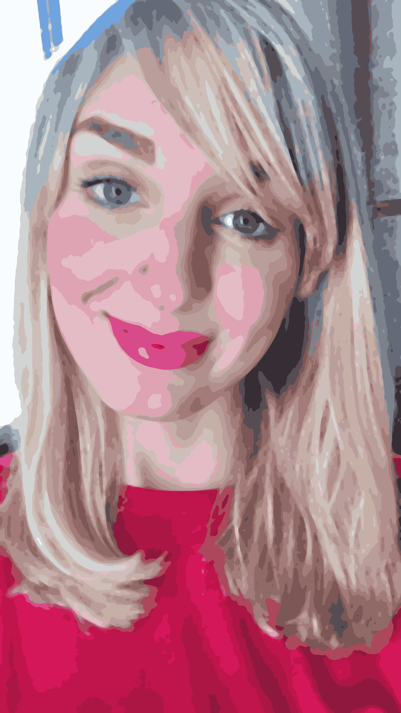

The corresponding canvas annotated with colors' numbers
from the palette.

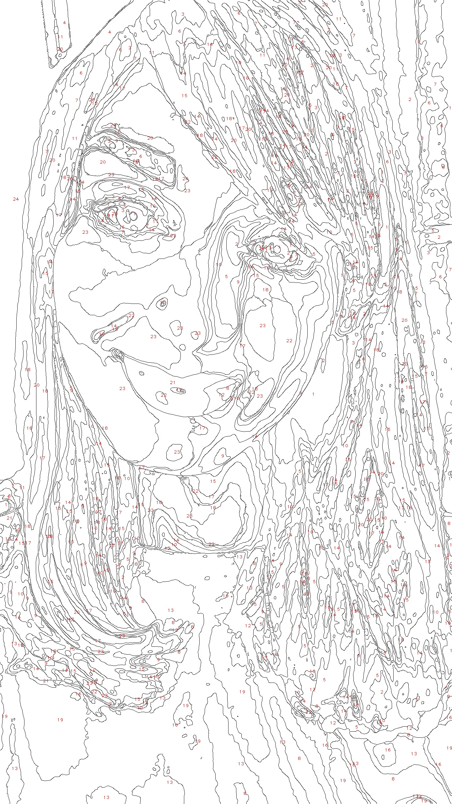	

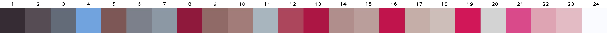	

These three files (toonified image, canvas, and palette) are obtained with

	./toonify images/meat-ball.jpeg 24 15 2.0